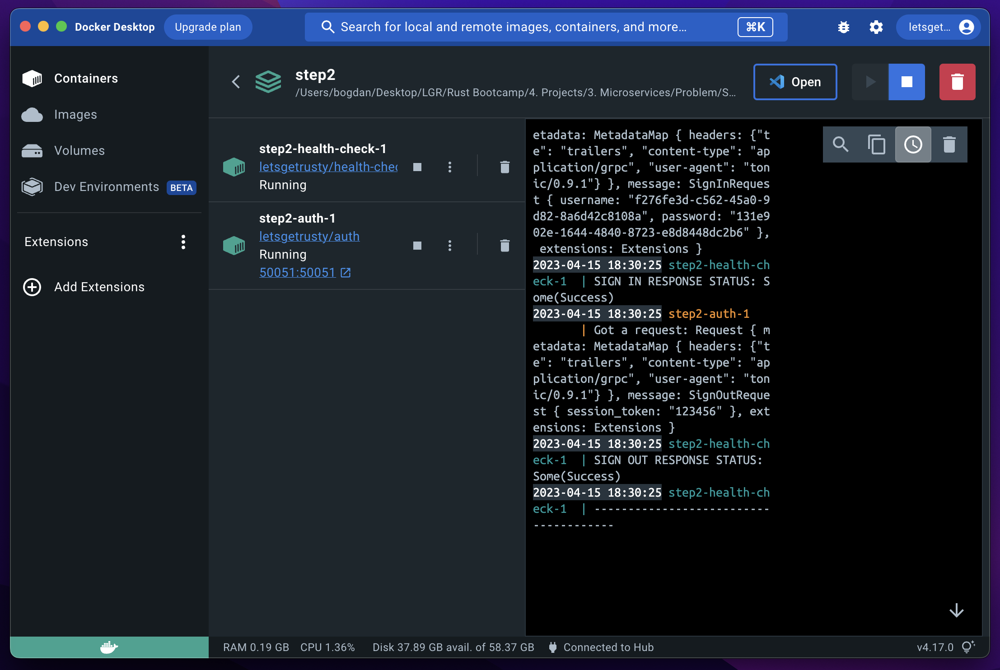

# Auth Microservice

A microservice app consisting of 2 services, an authentication service and a health check service, and a client that can communicate with the auth service.

## Features

The auth service has three primary features:

- Sign in
- Sign up
- Sign out

## Terminologies

### Session based authentication

[Session based auth][session-based-auth] works by giving the client a session token which can be used in subsequent requests to authenticate the user.

### Microservices

[Microservices][microservices] is an architectural style that structures an application as a collection of services that are independently deployable, loosely coupled, organized around business capabilities, and owned by a small team.

### CI/CD

[CI/CD][ci-cd] (Continuous Integration/Continuous Delivery or Continuous Deployment) is a set of practices and techniques that help software development teams deliver high-quality software faster and more reliably. Continuous Integration refers to the process of frequently merging code changes from multiple developers into a central repository and running automated tests to detect any integration issues early on. Continuous Delivery/Deployment takes this a step further, automating the entire software release process, from building and testing to deploying the application to production. These practices help teams deliver software more frequently and with higher quality, reducing time-to-market and increasing customer satisfaction.

[ci-cd]: https://www.redhat.com/en/topics/devops/what-is-ci-cd
[microservices]: https://microservices.io/
[session-based-auth]: https://www.geeksforgeeks.org/session-vs-token-based-authentication/
